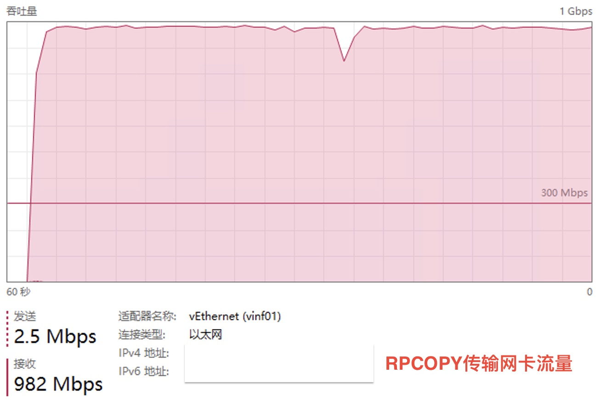

# zcp

跨机器文件夹RPC复制工具

## Feature

1. 支持 `windows`、`linux`、`mac` 互传；

1. 支持筛选文件，类似于 `robocopy` 的筛选方式，无需每次发送全部文件列表；

1. 支持 `zstd` 压缩，相同的文件不会重复传输，最小化网络流量；

1. 将小文件批量压缩成单一大文件再传输，极大降低无效网络连接数，提高速度；

1. 限定上传根目录，用户无法将文件上传到服务端指定的路径之外的目录；

1. 服务端可以指定是否允许覆盖已经存在的文件；

1. 如果需要加密传输，可以启用 `TLS` 安全加密传输，自定义域名，双向证书认证，无证书的客户端无法连接；

1. 支持不传输文件，仅比较本地文件和服务器端文件是否相同；


## Performance

| 237202 个文件，5989 MB     |    zcp    |    scp   |   cp    |
|--------------------------|-----------|-----------|---------|
|     localhost 传输        |     99 秒 |   123 秒  |  78 秒  |





## Quick Start

1） 在 `Machine A` 上面启动 `server` 端

```Bash
./zcp server --target-dir=/Volumes/SSD256/logs/nn01 --host=192.168.0.33 --port=9527
#
# 服务端会将所有收到的文件保存在 --target-dir= 指定的 /Volumes/SSD256/logs/nn01 文件夹下面
# 文件夹结构与传输进来的一致
#
# --overwrite：如果服务器上已经存在了，是否允许客户端覆盖，默认为 true： 允许覆盖
#
```

2） 在 `Machine B` 上面使用 `客户端` push / diff 文件夹

```Bash
./zcp push --source-dir=/data/hadoop/logs/nn01 --host=192.168.0.33 --port=9527
#
# push 命令，超过32MB的大文件会并行的一个一个的传送文件到服务端，小于32MB的小文件会被分批压缩打包再传送到服务端解压缩
#

#
# --follow-symlink： 默认 false，只会复制软连接（如果服务端目标文件不存在，该软连接实质上无效），如果为 true， 则会复制链接到的整个目标文件
# --follow-symlink=false： 适合于软连接指向的都是相对路径、没有跨分区文件指向、没有外部文件夹指向；在服务器上，同路径同名称的也是软连接；
# --follow-symlink=true： 适合于软连接指向路径不确定性多，更期待于直接将文件本身保存的情况；在服务器上，同路径同名称的是实际文件， 而不是软连接；
#
# 过滤文件夹下的文件，按需复制：
# --ignore-dot-file： 是否忽略点(.)开头的文件, 如： .DS_Store
# --log-dir：发送文件在服务端接收的结果报告，按日期分为保存成功的（_success.log)和保存失败的（_failure.log)文件列表
#
# --ext：只拷贝指定后缀名的文件， .mp4 只拷贝 mp4 文件， .png 只拷贝 png 图片， .(mp4|txt|png)同时拷贝 mp4、txt、png三类文件
# --min-size：忽略小于该值的文件
# --max-size：忽略大于该值的文件
# --min-size-mb：以 MB 单位表示文件大小，会自动转化成 --min-size
# --max-size-mb：以 MB 单位表示文件大小，会自动转化成 --max-size
# --min-age： 增量复制，忽略最后修改时间早于该值的文件， 格式: 2023-12-03,15:09:08（注意日期与时间中间有逗号）, 表示 2023-12-03 15:09:08
# --max-age： 增量复制，忽略最后修改时间晚于该值的文件
#
#
# --with-tls 是否启用TLS加密传输，默认不启用；该参数需要合格的服务器端、客户端证书同时有效。证书放在 cert 目录下，域名用户自定义，但文件夹结构、名称不能修改。
#

#
./zcp diff --source-dir=/data/hadoop/logs/nn01 --host=192.168.0.33 --port=9527
# 
# 比较本地文件夹和服务端文件夹下的文件是否相同，结果会保存在日志文件夹：zcp_different_files.txt
#
```

3） TLS 加密传输

下载默认的服务端和客户端证书，`cert_files_zcp_corpnet.zip`， 并将其解压在与 `zcp` 同级目录的 `cert` 目录中，一共`5个证书`。

或者用 仓库 中 `cert/_gen_cert/gen_cert.sh` 生成自己的域名证书, 需要先修改 `gen_cert.sh` 和 `openssl.conf` 中的域名，然后再运行 `./gen_cert.sh`

服务端 只需要 `cert/server` 和 `cert/ca.crt` 3个证书；

客户端 只需要 `cert/client` 和 `cert/ca.crt` 3个证书；

然后带有 --with-tls 启动。

启动服务端

```Bash
./zcp server --target-dir=/Volumes/SSD256/logs/nn01 --host="files.zcp.corpnet" --port=9527  --with-tls

```

在客户端、服务端需要修改 `/etc/hosts` 将域名指向你的服务端IP

```Bash
192.168.0.123   files.zcp.corpnet

```

启动客户端

```Bash
./zcp send --source-dir=/data/hadoop/logs/nn01 --host="files.zcp.corpnet" --port=9527  --with-tls

```

启用加密传输时， 两端的证书必须匹配，否则无法连接成功。

服务端的证书不应泄漏给任何人。

不同的客户端可以使用同一套客户端证书（简单），也可以为每个客户端生成不同的证书（专用）。

一般服务端证书 `cert/server` 和 `cert/ca.crt` 和域名始终不变，客户端的证书 `cert/client` 可以按需生成

如果域名发生改变，所有证书需要重新生成


